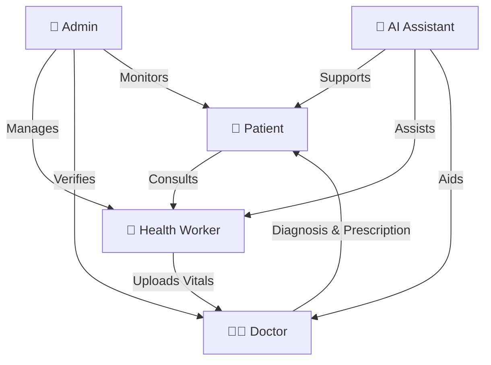

<div align="center">

# 🏥 Heal Connect

### Bridging Healthcare Gaps with AI-Powered Telemedicine

[](https://reactjs.org/)
[](https://vitejs.dev/)
[](LICENSE)

[🚀 Live Demo](#) • [📖 Documentation](#features) • [🤝 Contributing](#contributing) • [📧 Contact](#contact)

</div>

---

## 📋 Table of Contents

- [Overview](#-overview)
- [Problem Statement](#-problem-statement)
- [Our Solution](#-our-solution)
- [Key Features](#-key-features)
- [System Architecture](#-system-architecture)
- [User Roles](#-user-roles)
- [Tech Stack](#-tech-stack)
- [Getting Started](#-getting-started)
- [Project Structure](#-project-structure)
- [Screenshots](#-screenshots)
- [Roadmap](#-roadmap)
- [Contributing](#-contributing)
- [License](#-license)
- [Contact](#-contact)

---

## 🌟 Overview

**Heal Connect** is a comprehensive AI-powered telemedicine platform designed to revolutionize healthcare delivery in rural and underserved areas. By connecting patients, health workers, doctors, and administrators through a unified digital ecosystem, we're making quality healthcare accessible to everyone, everywhere.

### 🎯 Mission

To bridge the healthcare gap between urban and rural areas by leveraging technology, AI, and telemedicine to provide affordable, accessible, and quality healthcare services.

### 💡 Vision

A world where geographical barriers don't limit access to quality healthcare, and every individual can receive timely medical attention regardless of their location.

---

## 🚨 Problem Statement

### Healthcare Challenges in Rural Areas

```
┌─────────────────────────────────────────────────────────────┐
│                                                             │
│  🏥 Limited Access        👨‍⚕️ Doctor Shortage              │
│  • Remote locations       • 1 doctor per 10,000+ people    │
│  • Poor infrastructure    • Urban concentration            │
│  • High travel costs      • Specialist unavailability      │
│                                                             │
│  ⏰ Delayed Treatment     💰 High Costs                     │
│  • Late diagnosis         • Travel expenses                │
│  • Emergency delays       • Lost work days                 │
│  • Poor outcomes          • Medication costs               │
│                                                             │
└─────────────────────────────────────────────────────────────┘
```

---

## ✨ Our Solution

Heal Connect provides a **four-tier integrated healthcare delivery system**:



### 🔑 Core Value Propositions

| Feature | Benefit |
|---------|---------|
| 🏠 **Remote Consultations** | Access doctors from home |
| 🤖 **AI-Powered Triage** | Instant preliminary assessment |
| 📱 **Mobile-First Design** | Works on any device |
| 💊 **Digital Prescriptions** | Paperless, secure records |
| 📊 **Health Tracking** | Monitor vitals over time |
| 🔒 **Secure & Private** | HIPAA-compliant data protection |

---

## 🎯 Key Features

### For Patients 👤

```
┌─────────────────────────────────────────────────────────┐
│                                                         │
│  🤖 AI Health Assistant                                 │
│     • 24/7 symptom checker                             │
│     • Preliminary diagnosis                            │
│     • Health tips & guidance                           │
│                                                         │
│  📅 Book Consultations                                  │
│     • Browse verified doctors                          │
│     • Schedule appointments                            │
│     • Video/audio consultations                        │
│                                                         │
│  📋 Health Records                                      │
│     • Digital prescriptions                            │
│     • Visit history                                    │
│     • Vitals tracking                                  │
│                                                         │
│  💬 Secure Messaging                                    │
│     • Chat with doctors                                │
│     • Follow-up queries                                │
│     • Real-time notifications                          │
│                                                         │
└─────────────────────────────────────────────────────────┘
```

### For Health Workers 🏥

- **Patient Registration**: Onboard new patients with complete profiles
- **Vitals Collection**: Record BP, temperature, oxygen levels, etc.
- **Case Management**: Track and manage patient cases
- **Doctor Coordination**: Bridge communication between patients and doctors

### For Doctors 👨‍⚕️

- **Appointment Management**: View and manage consultation schedule
- **Teleconsultation**: Conduct video/audio consultations
- **Prescription Creator**: Generate digital prescriptions
- **Case Review**: Access patient history and vitals
- **Secure Messaging**: Communicate with patients and health workers

### For Administrators 👔

- **User Management**: Manage all platform users
- **Doctor Verification**: Verify credentials and licenses
- **Analytics Dashboard**: Monitor platform metrics
- **Appointment Oversight**: Track consultation statistics
- **Platform Settings**: Configure system parameters

---

## 🏗️ System Architecture

```
┌─────────────────────────────────────────────────────────────────┐
│                        PRESENTATION LAYER                        │
│  ┌──────────┐  ┌──────────┐  ┌──────────┐  ┌──────────┐       │
│  │ Patient  │  │  Health  │  │  Doctor  │  │  Admin   │       │
│  │   App    │  │  Worker  │  │   App    │  │   App    │       │
│  └──────────┘  └──────────┘  └──────────┘  └──────────┘       │
└─────────────────────────────────────────────────────────────────┘
                              ↕
┌─────────────────────────────────────────────────────────────────┐
│                       APPLICATION LAYER                          │
│  ┌────────────────────────────────────────────────────────┐    │
│  │              React Router (Navigation)                  │    │
│  └────────────────────────────────────────────────────────┘    │
│  ┌──────────┐  ┌──────────┐  ┌──────────┐  ┌──────────┐       │
│  │   Auth   │  │ Booking  │  │   Chat   │  │Analytics │       │
│  │ Context  │  │  System  │  │  System  │  │  Engine  │       │
│  └──────────┘  └──────────┘  └──────────┘  └──────────┘       │
└─────────────────────────────────────────────────────────────────┘
                              ↕
┌─────────────────────────────────────────────────────────────────┐
│                         DATA LAYER                               │
│  ┌────────────────────────────────────────────────────────┐    │
│  │              LocalStorage (Mock Backend)                │    │
│  │  • User Data  • Appointments  • Messages  • Records    │    │
│  └────────────────────────────────────────────────────────┘    │
└─────────────────────────────────────────────────────────────────┘
```

### 🔄 Data Flow Diagram

```
Patient Request → Health Worker Assessment → Doctor Consultation
       ↓                    ↓                        ↓
   AI Triage          Vitals Upload          Prescription
       ↓                    ↓                        ↓
   Recommendations    Case Creation          Digital Record
       ↓                    ↓                        ↓
   Patient Dashboard ← Admin Monitoring ← Analytics Engine
```

---

## 👥 User Roles

<table>
<tr>
<td width="25%" align="center">

### 👤 Patient
Access healthcare from anywhere

**Capabilities:**
- AI consultation
- Book appointments
- View prescriptions
- Track health records

</td>
<td width="25%" align="center">

### 🏥 Health Worker
First point of contact

**Capabilities:**
- Register patients
- Record vitals
- Submit cases
- Coordinate care

</td>
<td width="25%" align="center">

### 👨‍⚕️ Doctor
Provide expert care

**Capabilities:**
- Review cases
- Conduct teleconsults
- Create prescriptions
- Manage appointments

</td>
<td width="25%" align="center">

### 👔 Administrator
Oversee operations

**Capabilities:**
- User management
- Verify doctors
- Monitor analytics
- System settings

</td>
</tr>
</table>

---

## 🛠️ Tech Stack

### Frontend

```
┌─────────────────────────────────────────────────────────┐
│                                                         │
│  ⚛️  React 19.2.0        🎨 CSS3                       │
│     • Component-based     • Custom styling             │
│     • Hooks & Context     • Responsive design          │
│     • Modern patterns     • Animations                 │
│                                                         │
│  🚀 Vite 7.2.4           🧭 React Router 7.10.1        │
│     • Fast HMR            • Client-side routing        │
│     • Optimized builds    • Nested routes              │
│     • Dev experience      • Protected routes           │
│                                                         │
│  🎭 React Icons 5.5.0    📱 Mobile-First               │
│     • Icon library        • Responsive layouts         │
│     • Consistent UI       • Touch-friendly             │
│                                                         │
└─────────────────────────────────────────────────────────┘
```

### Development Tools

| Tool | Purpose |
|------|---------|
| 🔍 **ESLint** | Code quality and consistency |
| 🎨 **Custom CSS** | Styling and theming |
| 🗂️ **LocalStorage** | Mock data persistence |
| 🔧 **Vite** | Build tool and dev server |

### Key Dependencies

```json
{
  "react": "^19.2.0",
  "react-dom": "^19.2.0",
  "react-router-dom": "^7.10.1",
  "react-icons": "^5.5.0"
}
```

---

## 🚀 Getting Started

### Prerequisites

Before you begin, ensure you have the following installed:

- **Node.js** (v18.0.0 or higher)
- **npm** (v9.0.0 or higher) or **yarn**
- A modern web browser (Chrome, Firefox, Safari, Edge)

### Installation

1. **Clone the repository**

```bash
git clone https://github.com/yourusername/heal-connect.git
cd heal-connect
```

2. **Install dependencies**

```bash
npm install
```

3. **Start the development server**

```bash
npm run dev
```

4. **Open your browser**

Navigate to `http://localhost:5173` (or the port shown in your terminal)

### 🎭 Demo Credentials

Use these credentials to explore different user roles:

| Role | Email | Password |
|------|-------|----------|
| 👤 Patient | patient@demo.com | demo123 |
| 🏥 Health Worker | worker@demo.com | demo123 |
| 👨‍⚕️ Doctor | doctor@demo.com | demo123 |
| 👔 Admin | admin@demo.com | demo123 |

### Build for Production

```bash
# Create optimized production build
npm run build

# Preview production build locally
npm run preview
```

### Linting

```bash
# Run ESLint
npm run lint
```

---

## 📁 Project Structure

```
heal-connect/
│
├── 📂 public/                    # Static assets
│   ├── hero-bg.jpg
│   ├── logo.svg
│   └── team photos/
│
├── 📂 src/
│   ├── 📂 assets/                # Images and media
│   │   ├── avhb_village.png
│   │   ├── logo.svg
│   │   └── tech-stack.png
│   │
│   ├── 📂 components/            # Reusable components
│   │   ├── Navbar.jsx
│   │   ├── Footer.jsx
│   │   ├── Hero.jsx
│   │   ├── KeyFeatures.jsx
│   │   ├── HowItWorks.jsx
│   │   ├── TechStack.jsx
│   │   ├── Testimonials.jsx
│   │   ├── FAQ.jsx
│   │   └── ... (more components)
│   │
│   ├── 📂 pages/                 # Page components
│   │   ├── LandingPage.jsx
│   │   ├── Login.jsx
│   │   ├── About.jsx
│   │   ├── Contact.jsx
│   │   │
│   │   └── 📂 dashboards/        # Role-based dashboards
│   │       ├── PatientDashboard.jsx
│   │       ├── DoctorDashboard.jsx
│   │       ├── AdminDashboard.jsx
│   │       ├── HealthWorkerDashboard.jsx
│   │       │
│   │       ├── 📂 patient/       # Patient features
│   │       │   ├── AIChat.jsx
│   │       │   ├── BookConsultation.jsx
│   │       │   ├── DoctorDirectory.jsx
│   │       │   ├── MyVisits.jsx
│   │       │   ├── Messaging.jsx
│   │       │   └── Prescriptions.jsx
│   │       │
│   │       ├── 📂 doctor/        # Doctor features
│   │       │   ├── DoctorProfile.jsx
│   │       │   ├── Appointments.jsx
│   │       │   ├── CaseDetail.jsx
│   │       │   ├── Teleconsultation.jsx
│   │       │   ├── DoctorMessaging.jsx
│   │       │   └── PrescriptionCreator.jsx
│   │       │
│   │       ├── 📂 worker/        # Health worker features
│   │       │   ├── PatientRegistration.jsx
│   │       │   ├── VitalsUpload.jsx
│   │       │   ├── MyCases.jsx
│   │       │   └── WorkerMessaging.jsx
│   │       │
│   │       └── 📂 admin/         # Admin features
│   │           ├── UserManagement.jsx
│   │           ├── Analytics.jsx
│   │           ├── DoctorVerification.jsx
│   │           ├── AppointmentOversight.jsx
│   │           ├── MessagingMonitor.jsx
│   │           └── PlatformSettings.jsx
│   │
│   ├── 📂 context/               # React Context
│   │   └── AuthContext.jsx       # Authentication state
│   │
│   ├── 📂 data/                  # Mock data
│   │   └── mockData.js           # Sample data for demo
│   │
│   ├── 📂 utils/                 # Utility functions
│   │   └── storage.js            # LocalStorage helpers
│   │
│   ├── App.jsx                   # Main app component
│   ├── main.jsx                  # Entry point
│   ├── index.css                 # Global styles
│   └── responsive.css            # Responsive styles
│
├── 📄 index.html                 # HTML template
├── 📄 package.json               # Dependencies
├── 📄 vite.config.js             # Vite configuration
├── 📄 eslint.config.js           # ESLint configuration
├── 📄 vercel.json                # Deployment config
└── 📄 README.md                  # This file
```

---

## 📸 Screenshots

### Landing Page
<div align="center">

</div>

### Patient Dashboard
<div align="center">

</div>

### AI Chat Assistant
<div align="center">

</div>

### Doctor Consultation
<div align="center">

</div>

---

## 🗺️ Roadmap

### Phase 1: Foundation ✅ (Completed)
- [x] Core UI/UX design
- [x] User authentication system
- [x] Role-based dashboards
- [x] Basic consultation flow
- [x] Mock data integration

### Phase 2: Enhancement 🚧 (In Progress)
- [ ] Real backend API integration
- [ ] Video consultation feature
- [ ] Payment gateway integration
- [ ] SMS/Email notifications
- [ ] Advanced AI diagnostics

### Phase 3: Scale 📅 (Planned)
- [ ] Mobile app (React Native)
- [ ] Multi-language support
- [ ] Pharmacy integration
- [ ] Lab test booking
- [ ] Insurance integration
- [ ] Wearable device integration

### Phase 4: Innovation 🔮 (Future)
- [ ] Blockchain for medical records
- [ ] IoT device integration
- [ ] Predictive health analytics
- [ ] Telemedicine kiosks
- [ ] AR/VR consultations

---

## 🤝 Contributing

We welcome contributions from the community! Here's how you can help:

### Ways to Contribute

- 🐛 **Report Bugs**: Open an issue describing the bug
- 💡 **Suggest Features**: Share your ideas for improvements
- 📝 **Improve Documentation**: Help us make docs better
- 🔧 **Submit Pull Requests**: Fix bugs or add features

### Contribution Guidelines

1. **Fork the repository**
2. **Create a feature branch**
   ```bash
   git checkout -b feature/AmazingFeature
   ```
3. **Commit your changes**
   ```bash
   git commit -m 'Add some AmazingFeature'
   ```
4. **Push to the branch**
   ```bash
   git push origin feature/AmazingFeature
   ```
5. **Open a Pull Request**

### Code Style

- Follow the existing code style
- Use meaningful variable and function names
- Add comments for complex logic
- Ensure ESLint passes: `npm run lint`

---

## 📜 License

This project is licensed under the MIT License - see the [LICENSE](LICENSE) file for details.

```
MIT License

Copyright (c) 2026 Heal Connect

Permission is hereby granted, free of charge, to any person obtaining a copy
of this software and associated documentation files (the "Software"), to deal
in the Software without restriction, including without limitation the rights
to use, copy, modify, merge, publish, distribute, sublicense, and/or sell
copies of the Software, and to permit persons to whom the Software is
furnished to do so, subject to the following conditions:

The above copyright notice and this permission notice shall be included in all
copies or substantial portions of the Software.
```

---

## 📧 Contact

### Team Heal Connect

- 🌐 **Website**: [healconnect.com](#)
- 📧 **Email**: contact@healconnect.com
- 🐦 **Twitter**: [@healconnect](#)
- 💼 **LinkedIn**: [Heal Connect](#)

### Project Links

- 📦 **Repository**: [github.com/yourusername/heal-connect](https://github.com/yourusername/heal-connect)
- 🐛 **Issue Tracker**: [github.com/yourusername/heal-connect/issues](https://github.com/yourusername/heal-connect/issues)
- 📖 **Documentation**: [docs.healconnect.com](#)

---

## 🙏 Acknowledgments

- Thanks to all contributors who have helped shape Heal Connect
- Inspired by the need to democratize healthcare access
- Built with ❤️ for rural and underserved communities

---

<div align="center">

### ⭐ Star us on GitHub — it motivates us a lot!

Made with ❤️ by the Heal Connect Team

[⬆ Back to Top](#-heal-connect)

</div>
